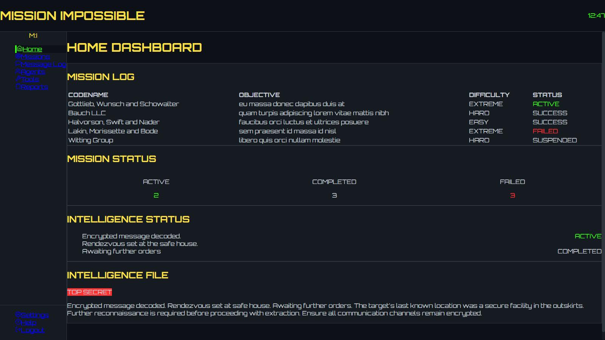

# Mission Impossible
A web app that allows users to create and manage their own secret spy missions, track mission progress, and decode encrypted messages from other agents.

#### By **Sharon Mumbi, Edwin Mwaniki, Jesse Matara**


## User Stories:

- As a secret agent, I want to create covert missions so that I can organize my espionage activities.
- As a user, I want to update mission status so that I can track my progress through dangerous assignments.
- As a spy, I want to send encrypted messages so that I can communicate secretly with other agents.

## Data Entity Structure:
- Mission -> {id, codename, objective, difficulty, status, location, agentAssigned, classified}
## Extra Features:
- Message encryption/decryption, mission difficulty calculator, agent -
- leaderboard, random mission generator.

## Screenshot



## Features

- Home page that displays the Dashboard that has:
    - Mission Log Panel
    - Intelligence Panel
    - Mission Status Panel
    - Intelligence Status Panel
    - Intelligence File Panel
- Mission Operations
- Secure Communications: with the message log
- Agents
- Tools
- Reports
- Shows the Time
- Side Bar: - Home, Missions, Messagelog, Agents, Tools and Reports

## How to Use

Visit the deployed application at: [The Mission](https://the-mission.vercel.app/home)

The live app allows you to:

- Browse through the Navigation
- View the Dashboard, View the mission operations, view secret communictions
- Also navigate to the Agents, Tools, Reports and view the current time

  
### Local Development

If you want to run the project locally, you'll need:

- Node.js installed on your computer
- Basic understanding of React JS
- Code editor (VS Code recommended)
- Terminal/Command Line

#### Installation Process

1. Clone this repository using:

   ```bash
   git clone git@github.com:edwin3v3/the-mission.git
   ```

   or by downloading a ZIP file of the code.

2. Navigate to the project directory:

   ```bash
   cd the-mission
   ```

3. Install the required dependencies:

   ```bash
   npm install
   ```

4. Run the development server:

   ```bash
   npm run dev
   ```

5. Open your browser and visit `http://localhost:5173`

## Technologies Used

- React JS
- Vite
- CSS3
- JavaScript (ES6)

## Related Repositories

- Github Repository: [Github Repository](https://github.com/edwin3v3/the-mission)
- Live Site using Vercel: [The-Mission](https://the-mission.vercel.app/home)

### Backend API

- Repository: [DBJSON API Repository](https://github.com/edwin3v3/mission-server/tree/main)
- Deployed API: [Live API URL](https://mission-server.onrender.com/missions)

## Support and Contact Details

If you have any questions, suggestions, or need assistance, please contact:

- Email: <shalon.mumbi@student.moringaschool.com>
- Email: <edwin.mwaniki@student.moringaschool.com>
- Email: <jesse.matara@student.moringaschool.com>

## License

MIT License

Copyright &copy; 2025 The Mission - Sharon Mumbi | Edwin Mwaniki | Jesse Matara

Permission is hereby granted, free of charge, to any person obtaining a copy of this software and associated documentation files (the "Software"), to deal in the Software without restriction, including without limitation the rights to use, copy, modify, merge, publish, distribute, sublicense, and/or sell copies of the Software, and to permit persons to whom the Software is furnished to do so, subject to the following conditions:

The above copyright notice and this permission notice shall be included in all copies or substantial portions of the Software.

THE SOFTWARE IS PROVIDED "AS IS", WITHOUT WARRANTY OF ANY KIND, EXPRESS OR IMPLIED, INCLUDING BUT NOT LIMITED TO THE WARRANTIES OF MERCHANTABILITY, FITNESS FOR A PARTICULAR PURPOSE AND NONINFRINGEMENT. IN NO EVENT SHALL THE AUTHORS OR COPYRIGHT HOLDERS BE LIABLE FOR ANY CLAIM, DAMAGES OR OTHER LIABILITY, WHETHER IN AN ACTION OF CONTRACT, TORT OR OTHERWISE, ARISING FROM, OUT OF OR IN CONNECTION WITH THE SOFTWARE OR THE USE OR OTHER DEALINGS IN THE SOFTWARE.
